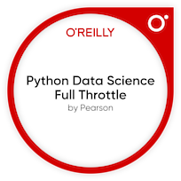

### Hi 👋 I'm Fakhruddin

- [My AI Repos](https://github.com/Fakhruddin90/fakhruddin-ai-repos)
<!--
**Fakhruddin90/Fakhruddin90** is a ✨ _special_ ✨ repository because its `README.md` (this file) appears on your GitHub profile.
-->
Here are some ideas to get you started:

- 🔭 I’m currently working on RAG Application
- 🌱 I’m currently learning generative AI
- 👯 I’m looking to collaborate on someone who is passionate about AI technology.
- 🤔 I’m looking for help with ...
- 💬 Ask me about passionate about AI and it's future, horse rider and archer, and openwater swimmer.
- 📫 How to reach me: [LinkedIn](https://www.linkedin.com/in/fakhruddin-mohamad-saupe-a49b8367/)
- 😄 Pronouns: Din
- ⚡ Fun fact: Tech Enthusiast

## Badges

<iframe width="560" height="315" src="https://www.youtube.com/embed/dQw4w9WgXcQ" frameborder="0" allowfullscreen></iframe>
